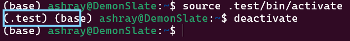
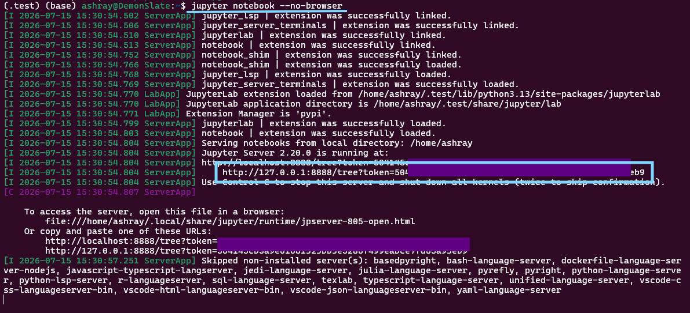

# NetSquid Installation on Windows using WSL

This is a detailed step-by-step guide on using the NetSquid library in Windows 11. 
We walkthrough setting up WSL, ubuntu terminal, python, venv then netsquid. 
> NetSquid is out of update and takes a lot of issues and errors with version mismatches or if you try to run it through Visual Studio Code WSL. This is the error free approach of launching Jupyter Notebook through Ubuntu terminal, and running netsquid on it.

## Setting up WSL
Standard procedure assuming windows 11.
- Search "Turn Windows features on or off" scroll down to bottom and turn on `Virtual Machine Platform` and `Windows subsystem for Linux` 
- Open PowerShell as **administrator** and type `wsl --install`. This command downloads the WSL components, enables the Virtual Machine Platform, and installs Ubuntu, unless the windows version is a bit more outdated.

## Ubuntu and Python setup
- Through Start menu search Ubuntu and open it to access the terminal
- On first time startup it will ask you to input an username and a password - input the same.
-  Update sudo: `sudo apt update` 
- Install python and pip using `sudo apt install python3 python3-pip`
- Install the package we will use to make a virtual environment using `sudo apt install python3-venv`

## Making a virtual environment
1. Use `python3.12 -m venv .netsquid_env` to make a virtual environment for netsquid with python 3.12  
> *NetSquid won't work above version 3.12*
2. Activate the environment using `source .netsquid_env/bin/activate`.
 This will show the environment name in place of 'base'. 

    For exameple, here for an exmaple env named `.test`:
    
> A virtual environment can be deactivated by simply typing `deactivate`.

## Installing netsquid
1. To install netsquid you must run the pip3 string in the terminal. I had attached the string with my user and password in mail; it looks like `pip3 install --user........`
   
   > Or make your own account on https://forum.netsquid.org/, get it activated, then use the username and password in the string: `pip3 install --user --extra-index-url https://<username>:<password>@pypi.netsquid.org netsquid` ! Activating forum account is a bit laggy and takes time.
2. Now, install Jupyter in this env using `pip3 install notebook`
3. Run the notebook in your browser using `jupyter notebook --no-browser`
4. Now you can `Ctrl+CLICK` on the below link or copy paste this link to open the notebook in browser of choice:

 

## Success! Making and running Jupyter Notebooks
After initial configuration, the process is very simple. Just open Ubuntu terminal, activate the environment using `source .netsquid_env/bin/activate` and run the notebook using `jupyter notebook --no-browser` 

In jupyter notebook file tree, the NetSquid environment is automatically active and you can make folders and notebooks using the plus icon on top right, or upload downloaded notebooks too.