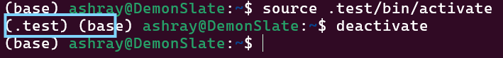
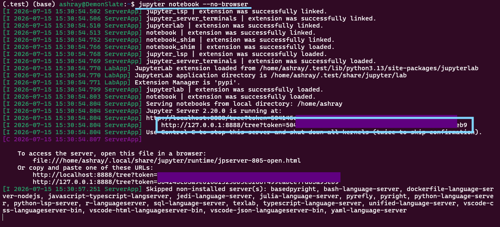

# Installing and running netsquid
## A) Local environment.
Takes some time to set up, but then can be run with just two steps. Without internet being required. 
### Making environment in Ubuntu:
1. Open the Ubuntu terminal
2. Use ```python -m venv .netsquid_env``` to make an env for netsquid
> In case venv is absent, please use ```sudo apt install python3-venv``` to install.
4. Activate the environment using ```source .netsquid_env/bin/activate```. This will show the env in place of 'base'. For exameple, here for an exmaple env named .test:<br>
<br>
The environment can be deactivated using ```deactivate```.
5. Now, install Jupyter for this env using ```pip install notebook```
6. Run the notebook in your browser using ```jupyter notebook --no-browser```
7. Now you can ```Ctrl+CLICK``` on the below link or copy paste this link to open the notebook in browser of choice:

> *Note*: After this configuration, each time you will only need to do step 4 and step 6 i.e. activation and opening notebook!
8. In the open notebook, the env is automatically active and you can make folders and notebooks using the plus icon on top right, or upload downloaded notebooks too.
### Installing netsquid:
This link needs username and password, in case you have yours please put it in this format (if pip doesn't work then try pip3) :<br>
```text
%pip install --user --extra-index-url https://<username>:<password>@pypi.netsquid.org netsquid
```

Else use mine which I sent in the email in same installation format!
Now netsquid is installed!
## B) Google Colab:
* I uploaded my notebook on colab and put the same installation link on top cell.
* Please execute the cell then restart kernel by going to Runtime->Restart Session.
* Now the code must work!

Colab notebook link was sent in the email!
